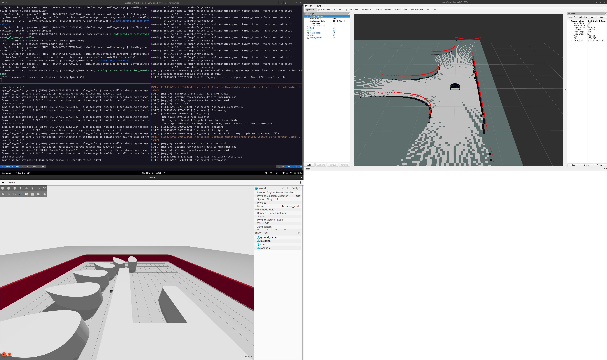

# rosbot_humble
A simple way to run [rosbot-xl simulation](https://github.com/husarion/rosbot-xl-mapping) without using docker compose.

## Prerequisities
- [Ubuntu 22.04](https://linuxways.net/ubuntu/dual-boot-ubuntu-22-04-alongside-windows-11/) (it should also work in Ubuntu 20.04)
- [Docker](https://www.digitalocean.com/community/tutorials/how-to-install-and-use-docker-on-ubuntu-22-04) (Remember to set user permission to use `docker` and not `sudo docker`)
- [nvidia-container-toolkit](https://docs.nvidia.com/datacenter/cloud-native/container-toolkit/install-guide.html#setting-up-nvidia-container-toolkit)
- [vcstool](http://wiki.ros.org/vcstool)

## Build The Docker Image

Clone this repository

```bash
git clone git@github.com:CatInTheRain/rosbot_humble.git
```

if you have problems you have to set the ssh key associated with your github account. [This](https://docs.github.com/en/authentication/connecting-to-github-with-ssh/generating-a-new-ssh-key-and-adding-it-to-the-ssh-agent) is a possible way to set key.

Then go to the repository, clone all the packaets and build the docker
```bash
cd rosbot_humble/
./clone_repos.sh
./build_sim.sh
```
The script will download all the necessary files inside the docker container and after the image is completed two ROS2 workspaces are built. These thow workspaces are mounted inside the docker.
If everything is okay you will see something like this


---

### Run the simulation
To test if everything is ok with rosbot XL and ROS2 run from local PC

```bash
[<your_name>@<PC_name> ~]$./go_sim.sh
```

You are now inside the Docker container

```
nuctella@<PC_name>:~/ros2_ws/ws$ colcon_cd core
nuctella@<PC_name>:~/my_ros2_ws/src/core$ cd startup/
nuctella@<PC_name>:~/my_ros2_ws/src/core/startup$ ./sim.sh
```

You will see something like this:


To exit you can click on the terminal with the panels and tap <kbd>Ctrl</kbd> + <kbd>A</kbd> + <kbd>K</kbd>.
There are other usefull shortkeys in tmux:
- <kbd>Alt</kbd> + <kbd>Key Arrows</kbd> switch panels
- <kbd>Ctrl</kbd> + <kbd>A</kbd> + <kbd>T</kbd> new window
- <kbd>Shift</kbd> + <kbd>Key Arrows</kbd> switch windows
- <kbd>Ctrl</kbd> + <kbd>O</kbd> split horizontally
- <kbd>Ctrl</kbd> + <kbd>E</kbd> split split vertically
- <kbd>Ctrl</kbd> + <kbd>A</kbd> + <kbd>D</kbd> detach (to come back run `tmux a` con terminal)

Alternatively you can inspect the file `my_ros2_ws/src/core/startup/session_sim.sh` and run `terminator` on the terminal. One red panel will open and you can split it with the previous shortkeys. On each panel you can run each command of the `session_sim.sh`:
- `ros2 launch rosbot_xl_gazebo simulation.launch.py mecanum:=${MECANUM:-True}`
- `ros2 run rviz2 rviz2 -d /config/rosbot.rviz`
- `ros2 launch slam_toolbox online_sync_launch.py slam_params_file:=/config/slam_toolbox_params.yaml use_sim_time:=True`
- `bash -c "while true; do ros2 run nav2_map_server map_saver_cli --free 0.15 --fmt png -f /maps/map; sleep 5; done"`

Simulation runs by this launch file, that calls other launch files like matrioska.

Inspecting the `session_sim.sh` to understand all the SLAM simulation

Other usefull commands during simulation:
- `rqt_graph`
- `ros2 run rqt_tf_tree rqt_tf_tree`
- `ros2 run plotjuggler plotjuggler`

## Workspace structure

There are three workspaces inside the docker container

- `/home/nuctella/ros2_ws/deps` dependencies of simulations
- `/home/nuctella/ros2_ws/ws` packages for the simulation 
- `/home/nuctella/my_ros2_ws` your new packages that you want add

Every modification that you make in `ros2_ws/ws` and in `my_ros2_ws` it will remain also in your local PC, even if you will exit from the docker. These two folders are mounted in `go_sim.sh`, in the root of the project.

If you exit from the container all things that you install will be lost. You can edit **ONLY THE BOTTOM** of the Dockerfile and then run `build_sim.sh` to mantain the edit. 
For example, if you want to work with `gedit` you can add it here

```dockerfile class:"lineNo"
# Install extra packages
258 RUN sudo apt-get update && sudo apt-get install -y \
259    terminator \
260    ranger \
261    ros-humble-plotjuggler-ros \
262    ros-humble-rqt-tf-tree \
263    gedit
```
Then, if you run in your local PC `build_sim.sh` and then you enter in the container with `./go_sim.sh`, gedit should be installed forever.

## How to develop code

Feel free edit the packages `/home/nuctella/my_ros2_ws` `/home/nuctella/ros2_ws/ws` and to add your personal packages. I advice you to develop using **Visual Studio Code** and install the extensions for docker and docker containers, in this way you can develop directly inside the dockerfile.

**If you have some doubts or question about ROS2 Humble follow this** [link](https://letmegooglethat.com/?q=ros2+humble+documentation).

There is also one useful package called `ROS2_learning`, with a lot of basic examples, you can find here `/home/nuctella/my_ros2_ws/src/ROS2_learning`, however on internet you can find a lot of usefull help for coding problems.


If you don't know how to develop using git you can follow [this guide](https://learngitbranching.js.org/) and the [official guide](https://git-scm.com/docs/git-commit) or also [this](https://www.atlassian.com/git/tutorials/saving-changes/git-commit). Or you can use [gitkraken](https://www.gitkraken.com/).

Tip: There are some useful alias in ~/.bashrc (inside the docker)
---

### Bug Report
- There are bugs regarding the RGBD and the orbbec_astra. If you have to work with RGB images work with `intel_realsense_d435.urdf.xacro`. You can try to solve by yourself debug, also inspecting this [link](https://github.com/gazebosim/docs/blob/master/citadel/sensors.md) and comparing with this [link](https://github.com/gazebosim/ros_gz/tree/ros2/ros_gz_sim_demos).

### Interesting things

- This is interesting [new repo about nav2](https://github.com/husarion/navigation2-docker)

---

## Credits
- https://github.com/husarion/rosbot-xl-docker
- https://github.com/husarion/rosbot-xl-mapping

## Extra
<!-- ### You can try to recover the dockerfile from the docker image

[Reference Link](https://github.com/husarion/rosbot-xl-docker/blob/main/Dockerfile.simulation)

To inspect the image:

```bash
docker run --rm \
    -v /var/run/docker.sock:/var/run/docker.sock \
    alpine/dfimage husarion/rosbot-xl-gazebo:humble-0.3.0-20230204 -->
```
